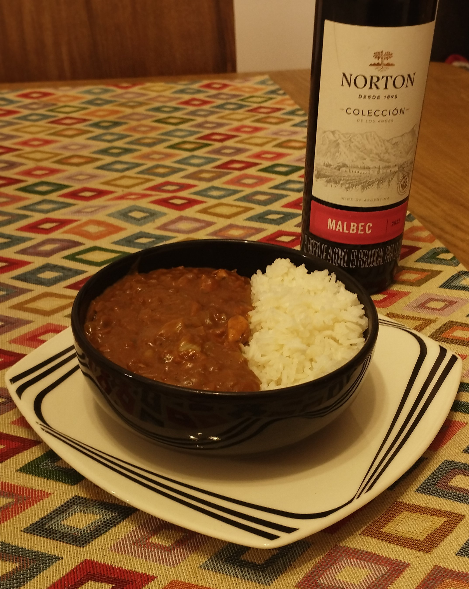

Something people say about curry is that it is an extremely spicy and hot dish. And while it is true that there are a lot of spices involved, there is no need for it to be hot. That is the case for this japanese style curry that uses a slow cook and some additional fat to better combine flavours, and create a texture that can be accompanied with almost any carb and drink.

<!--more-->

## Ingredients

### Roux(base):
- 125gr butter
- 125gr wheat flour
- 2tsp cumin
- 2tbs cilantro
- 2tsp turmeric
- 1tsp paprika
- 1tsp cayenne
- 1tsp nutmeg
- 1/2tsp black pepper

### Stew:
- 300gr Carrot
- 600gr white onion
- 300gr apple
- Garlic to taste
- Laurel to taste
- Ginger to taste
- 600gr chicken breast
- 1l chicken broth
- 50gr dark chocolate
- 1tbs instant coffee
- 1tbs honey
- 100gr greek yogurt

## Instructions
### Mise en Place:
1. Grate carrots, apple and ginger. Put aside in a bowl.
2. Dice onion and garlic.
3. Dice chicken breast, and season to taste.

### Roux:
1. Roast cilantro, and mix with the other roux spices.
2. Melt the butter in the same pan, and mix with the spices.
3. Slowly add the wheat flour and mix until you get a uniform texture.

### Stew:
1. Sear chicken breast with a little oil, and put aside.
2. On the same oil where the chicken breast was seared, fry onion and garlic until golden. Don't forget to season.
3. Add carrrot, apple and chicken breast. Let it cook at medium heat for 2 minutes.
4. Add broth, laurel and honey. Let it boil.
5. Once boiling, slowly add the roux, and let it cook until it thickens.
6. Once thickened, add chocolate, coffee and yogurt. Mix and let it cook on medium heat for a couple minutes.

## Tips and tricks
- You can replace the spices used in the roux with a curry mix.
- You can also replace the chicken breast with beef or other meat.
- when reheating, you can add a dash of red wine to enrichen the flavor.

## How to Serve
- It can be served with white rice or another carb.
- White meat is used to prepare this dish, but I personally prefer to accompany with red wine.

## Nutrition Facts

| Calories      | 490Cal  |
|---------------|---------|
| Protein       | 28.63gr |
| Fat           | 22.92gr |
| Carbohydrates | 41.40gr |
