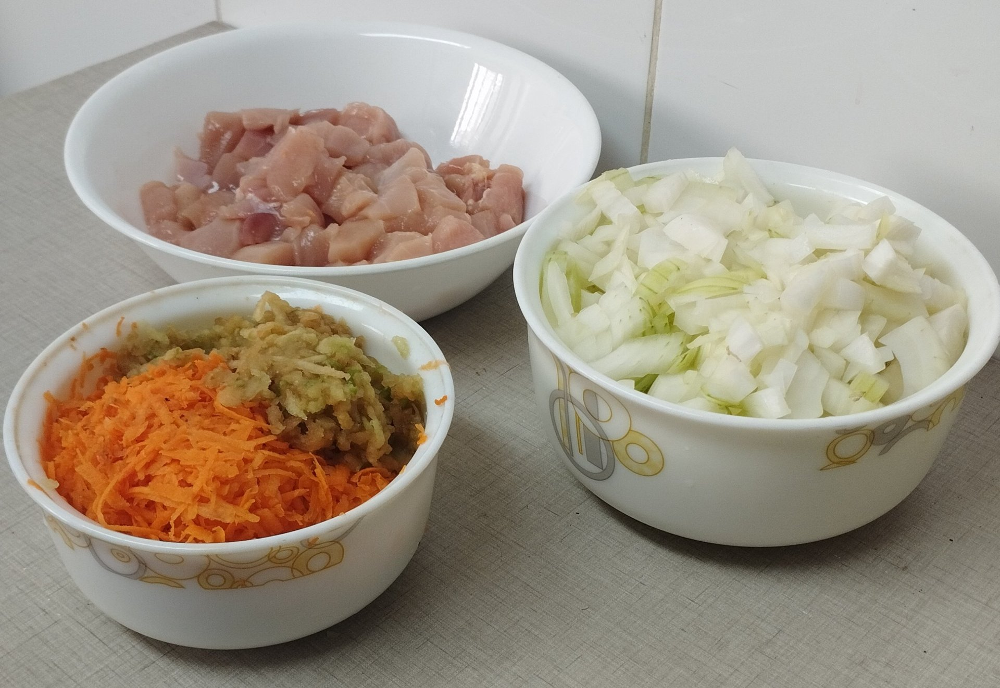

Man sagt über Curry, dass es ein extrem würziges un scharfes Gericht ist. Und obwohl viele Gewürze im Spiel sind, muss es nicht scharf sein. Das gilt für dieses Curry nach japanischer Art, das langsam gekocht wird und etwas zusätzliches Fett verwendet, um die Aromen besser zu kombinieren und eine Konsistenz zu erzeugen, die mit fast allen Kohlenhydraten und Getränken serviert werden kann.

<!--more-->

## Zutaten

### Roux(Basis):
- 125gr Butter
- 125gr Weizenmehl
- 2tl Kreuzkümmel
- 2el Koriander
- 2tl Kurkuma
- 1tl Paprikapulver
- 1tl Cayennepfeffer
- 1tl Muskatnuss
- 1/2tl schwarzer Pfeffer

### Eintopf:
- 300gr Karotten
- 600gr weiße Zwiebeln
- 300gr Äpfel
- Knoblauch nach Geschmack
- Lorbeer nach Geschmack
- Ingwer nach Geschmack
- 600gr Hühnerbrust
- 1l Hühnerbrühe
- 50gr dunkle Schokolade
- 1el Instantkaffee
- 1el Honig
- 100gr griechischer Joghurt

## Anleitung
### Mise en Place:
1. Karotten, Äpfel und Ingwer reiben. In einer Schüssel beiseite stellen.
2. Zwiebeln und knoblauch in Würfel schneiden.
3. Hühnerbrust in Würfel schneiden, und nach Geschmack würzen.

### Roux:
1. Koriander rösten und mit den anderen Roux Gewürzen vermischen.
2. In derselben Pfanne die Butter schmelzen und mit den Gewürzen vermischen.
3. Weizenmehl langsam hinzufügen und verrühren, bis eine gleichmäßige Konsistenz entsteht.

### Eintopf:
1. Hühnerbrust mit ein bisschen Öl anbraten und beiseite stellen.
2. Braten Sie Zwiebel und Knoblauch im selben Öl, in dem Sie die Hühnerbrust angebraten haben, goldbraun an. Vergiss nicht, zu würzen.
3. Karotten, Äpfel, Ingwer und Hühnerbrust hinzufügen. Bei mittlerer Hitze 2 Minuten kochen lassen.
4. Hühnerbrühe, Lorbeer und Honig hinzufügen. Aufkochen lassen.
5. Wenn es aufkocht, Roux langsam hinzufügen. Kochen lassen, bis es eindickt.
6. Wenn es eindickt, dunkle Schokolade, Instantkaffee und griechischer Joghurt hinzufügen. Vermischen und ein Paar Minuten kochen lassen.

## Tipps und Tricks
- Du kannst die Gewürze in das Roux durch eine Currymischung ersetzen.
- Du kannst die Hühnerbrust auch durch Rindfleisch oder anderes Fleisch ersetzen.
- Wenn Aufwärmen Kannst du ein bisschen Rotwein hinzufügen, um den Geschmack zu verfeinern.

## Wie man serviert
- Es kann mit weißem Reis oder anderen Kohlenhydrat serviert werden.
- Diese Gericht helles Fleisch nutzen, ich persönlich trinke dazu aber am liebsten Rotwein.

## Nährwerte

| Kalorien      | 490Cal  |
|---------------|---------|
| Eiweiß        | 28.63gr |
| Fett          | 22.92gr |
| Kohlenhydrate | 41.40gr |
