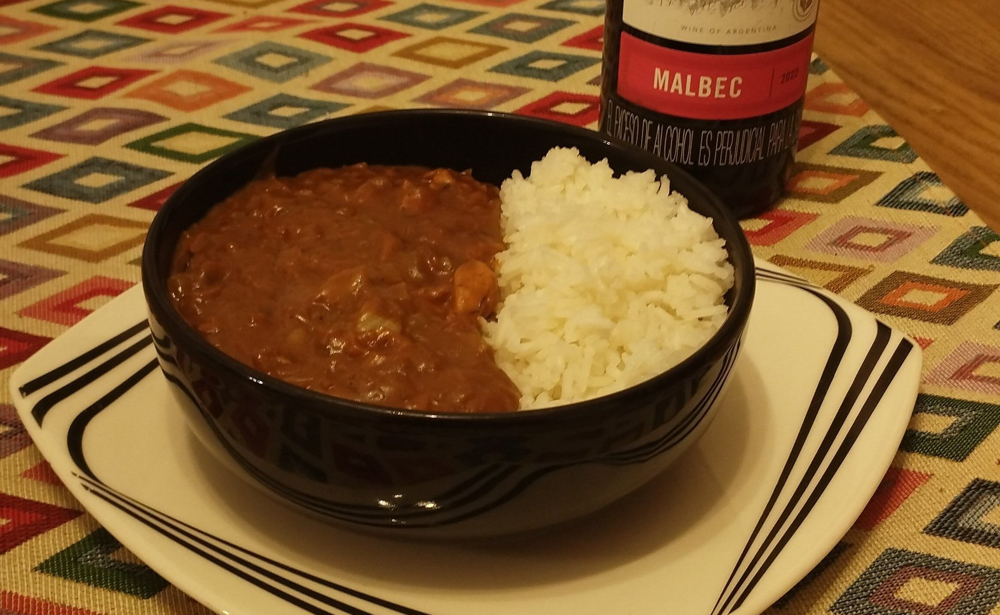
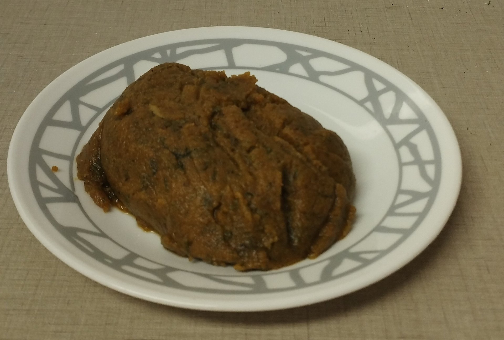
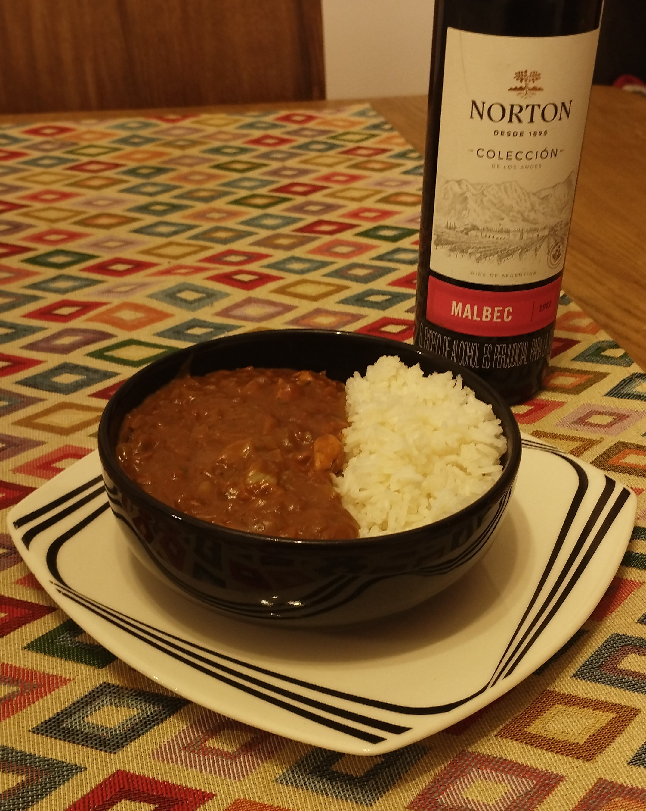

Algo que dicen siempre del curry es que es un plato en extremo condimentado y picante. Y pues es cierto que se usan bastantes especias, pero no tiene que ser picante. Este es el caso de este curry estilo japones que aprovecha una cocción lenta y grasa adicional para combinar los sabores, y crear una textura que se puede acompañar con prácticamente cualquier carbohidrato y bebida.

<!--more-->

## Ingredientes Para 6 Porciones

### Roux(base):
- 125gr mantequilla
- 125gr harina de trigo
- 2cdtas cómino
- 2cdas cilantro
- 2cdtas cúrcuma
- 1cdta paprika
- 1cdta cayena
- 1cdta nuez moscada
- 1/2cdta pimienta negra

### Estofado:
- 300gr zanahoria
- 600gr cebolla
- 300gr manzana
- Ajo al gusto
- Laurel al gusto
- Gengibre al gusto
- 600gr pechuga de pollo
- 1l caldo de pollo
- 50gr chocolate oscuro
- 1cda café instantaneo
- 1cda miel
- 100gr yogurt griego

## Instrucciones
### Mise en Place:
1. Rayar zanahoria, manzana y gengibre. Separar en un solo recipiente.
2. Cortar cebolla y ajo en cubos.
3. Cortar pollo en cubos y adobar al gusto.

### Roux:
1. Tostar cilantro y mezclar con todas las especias del roux.
2. Sobre el cilantro y las especias, derretir la mantequilla y mezclar.
3. Integrar lentamente la harina hasta tener una consistencia uniforme.

### Estofado:
1. En un poco de aceite hirviendo, sellar el pollo y separar.
2. Sobre el mismo aceite en el que se selló el pollo, freir cebolla y ajo hasta dorar. No olvidar sazonar al gusto.
3. Añadir zanahoria, manzana, gengibre y pollo. Dejar Cocinar a fuego medio por 2 minutos.
4. Añadir caldo, laurel y miel, y dejar hervir.
5. Una vez esté hirviendo, integrar lentamente el roux, y dejar cocinar hasta que espese.
6. Una vez haya espesado, agregar chocolate, café y yogurt. Mezclar y dejar cocinar a fuego medio por unos minutos.

## Trucos y sugerencias
- Se pueden reemplazar las especias del Roux por una mezcla para curry.
- También se puede reemplazar el pollo por res u otra carne.
- Al momento de recalentar el plato, se puede añadir un poco de vino tinto para añadir más sabor.

## Cómo Servir
- Para servir se puede acompañar con arroz blanco o algún otro carbohidrato.
- Se usa una carne blanca, pero en lo personal prefiero acompañar con un vino tinto.

## Datos Nutricionales

| Calorias      | 490Cal  |
|---------------|---------|
| Proteína      | 28.63gr |
| Grasa         | 22.92gr |
| Carbohidratos | 41.40gr |
