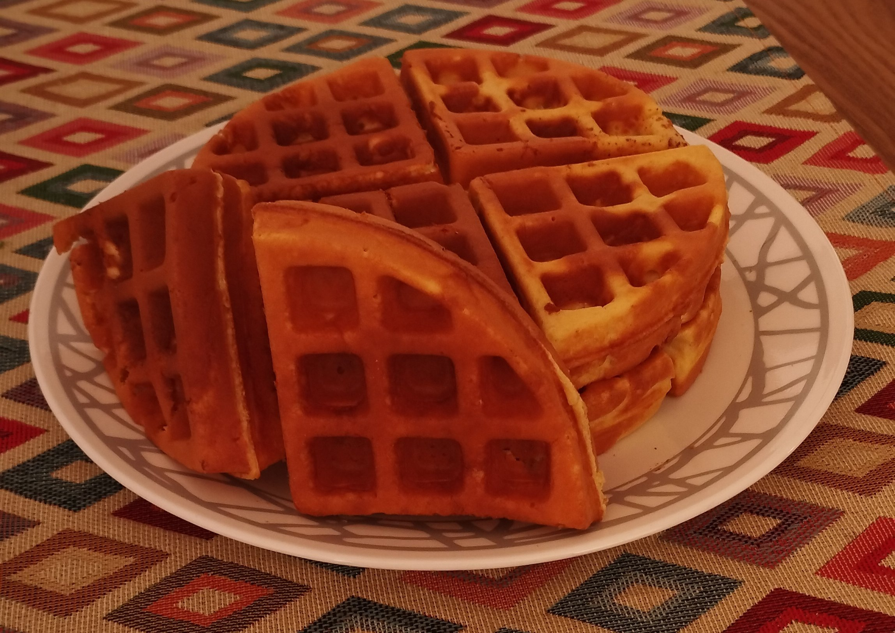

I've already shared a recipe for lunch and another for a snack. It seemed fair to round it off with something for breakfast. I was thinking of several options, some more complex than others. In the end I decided on something relatively simple to make and versatile because it can be accompanied by practically anything you can imagine. Not only that, but continuing with the "theme" of high protein dishes, this one doesn't get left behind.

<!--more-->

## Ingredients for 2 Servings
- 100gr milk cream
- 125ml milk
- 2 eggs
- 20ml olive oil
- Honey to taste
- 150gr wheat flour
- 50gr protein powder
- A pinch of salt
- 1/2tsp baking powder

## Instructions
1. Preheat waffle iron.
2. Beat milk cream, milk, eggs, honey and oil in a bowl.
3. Slowly add protein, flour, salt and baking powder. Beat until you get a uniform consistency.
4. Pour mixture into waffle iron. Cook for 5 or 7 minutes.

## Tips and tricks
- The iron must be very hot to avoid the waffles sticking to it.
- The waffles can be kept warm using an oven or a toaster.
- If you have no waffle iron, this mixture can be made into pancakes.

## Nutrition Facts

| Calories      | 733Cal  |
|---------------|---------|
| Protein       | 40.59gr |
| Fat           | 36.87gr |
| Carbohydrates | 59.62gr |
