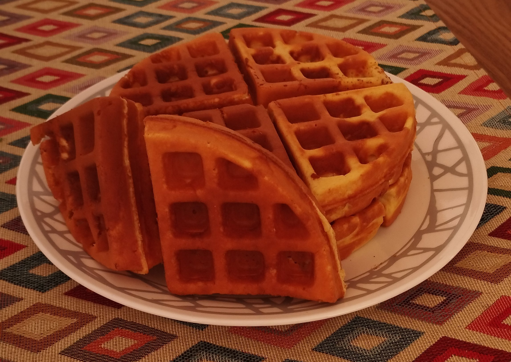

Ich habe bereits ein Rezept für das Mittagessen und ein weiteres für einen Snack geteilt. Es schien angemessen, es mit etwas zum Frühstück abzurunden. Ich habe über mehrere Optionen nachgedacht, einige komplexer als andere. Am Ende habe ich mich für etwas entschieden, das relativ einfach zuzubereiten und vielseitig ist, da man es mit praktisch allem kombinieren kann, was man sich vorstellen kann. Und nicht nur das, sondern um beim „Thema“ der proteinreichen Gerichte zu bleiben, bleibt dieses Gericht nicht zurück.

<!--more-->

## Zutaten für 2 Stücke
- 100gr Milchsahne
- 125ml Milch
- 2 Eier
- 20ml Olivenöl
- Honig nach Geschmack
- 150gr Weizenmehl
- 50gr Proteinpulver
- Eine Prise Salz
- 1/2tl Backpulver

## Anleitung
1. Waffeleisen vorheizen.
2. Milchsahne, Milch, Eier, Honig und Olivenöl in einer Schüssel verrühren.
3. Proteinpulver, Mehl, Salz und Backpulver langsam hinzufügen. Verrühren, bis eine gleichmäßige Konsistenz entsteht.
4. Mischung ins Waffeleisen geben. 5 bis 7 Minuten backen.

## Tipps und Tricks
- Das Waffeleisen muss sehr heiß sein, damit die Waffeln nicht daran kleben bleiben.
- Die Waffeln können im Backofen oder Toaster warmgehalten werden.
- Wenn man kein Waffeleisen haben, können aus dieser Mischung Pfannkuchen gemacht werden.

## Nährwerte

| Kalorien      | 733Cal  |
|---------------|---------|
| Eiweiß        | 40.59gr |
| Fett          | 36.87gr |
| Kohlenhydrate | 59.62gr |
